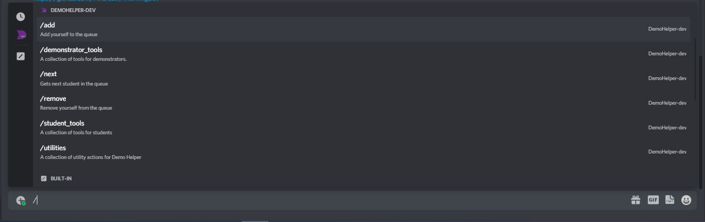

<h1>DemoHelper v3</h1>

[](https://discord.gg/PzqhkafaUV)

<span>
  
  
</span>


# 1.0 About
DemoHelper stores a queue of students waiting for demonstrators in their work.


# 1.1 Reference Guide
The Discord Bot Reference Guide has a section on DemoHelper.
At the time of this writing, it's under section 6.\
The reference guide can be found here: https://docs.scorpia.network/pdfs/discordbotreferenceguide.pdf

# 1.2 Installation Instructions
1. Ensure that the following are installed:
    - python3
    - pip
    - pipenv
    - git
2. Open the terminal and run the following
    ```bash
    cd ~
    git clone https://github.com/AberDiscordBotsTeam/demoHelperBot
    cd demoHelperBot
    pipenv install
    ```
3. Go to the Discord Developer Portal (https://discord.com/developers/applications),
   create a new application, go to the bot tab, add a bot and then copy the token from that tab
4. Rename `config.ini.TEMPLATE` to `config.ini` and populate the `DISCORD.token` and `DISCORD.invite-url` variables
5. Use `pipenv run python3 -m demobot` to run the server
7. Navigate to the 0Auth2 tab and select bot from the scopes section, 
   scroll down and select the bot permissions: View channels and Send Messages.
   Copy the link from the scopes section and paste it into your web browser and select the servers you want to add the bot to
   
# 1.3 Configuring a Systemd Service
Run the following
```bash
sudo nano /etc/systemd/system/DemoHelper.service
```
Then copy and paste the following into that file.
```
[Unit]
Description=DemoHelper
After=network.target
StartLimitIntervalSec=0

[Service]
Type=simple
Restart=always
RestartSec=1
User=<username>
WorkingDirectory=/home/<username>/demoHelperBot
ExecStart=/usr/bin/pipenv run python3 -m demobot

[Install]
WantedBy=multi-user.target
```
Then run the following
```bash
sudo systemctl daemon-reload
```

## 1.3.1 Systemd Commands
- `sudo systemctl start DemoHelper` - start the service
- `sudo systemctl status DemoHelper` - get the status of the service
- `sudo systemctl stop DemoHelper` - stop the service
- `sudo systemctl restart DemoHelper` - restart the service
- `sudo systemctl enable DemoHelper`//`sudo systemctl disable DemoHelper` - enable//disable the service on boot of server.
- `journalctl -ru DemoHelper.service` - view recent logs

   
# 1.4 General Maintenance
- `pipenv update` to update dependencies
- `git pull` to pull updates from the repository
- `systemctl restart demoBot` to restart the service
