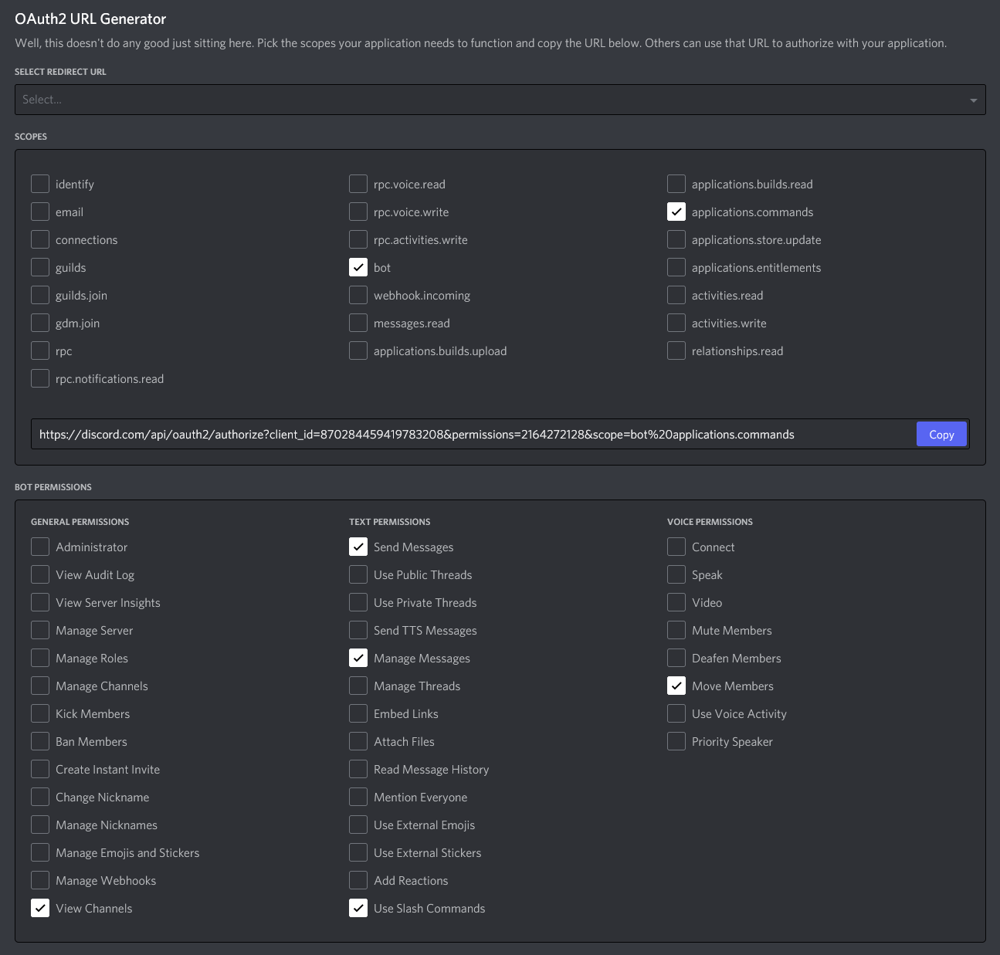

# DemoHelper v2
[](https://discord.gg/PzqhkafaUV)

# 1. Contents
- 1\. Contents
- 2\. About
  - 2.1 Warnings
- 3\. Requirements
  - 3.1. `.env` file
- 4\. Installing DemoHelper on Your Hosting Server
  - 4.1 Prerequisites
  - 4.2 By Operating System
    - 4.2.1 Debian
  - 4.3 Running as a Service
    - 4.3.1 PM2
    - 4.3.2 Systemd
- 5\. Maintenance

# 2. About
DemoHelper stores a queue of students waiting for demonstrators to aid them with their work.
## 2.1 Warnings
**Please note:**  The user requires one of the following roles with the same name to have full access to all 
the bots commands: Demonstrator, demonstrator, DEMONSTRATOR, Admin role, ADMIN ROLE, Admin, Devs

# 3. Requirements
## 3.1 `.env` file
This file stores secrets such as the Discord Token.
A template can be seen below:
```
DISCORD_TOKEN=""
```

# 4. Installing DemoHelper on Your Hosting Server
## 4.1 Prerequisites
1. Head to https://discord.com/developers/applications.
2. Click on `New Application` in the top right.
3. Give it a name
4. Head to the `OAuth2` menu
5. Check the boxes shown below:
  
6. Copy the generated URL into the `.env` file as the value for the key `INVITE_URL`
7. Head to the `Bot` menu
8. Click `Add Bot`
9. Click `Yes, do it!`
10. Click `Copy` under `Click to Reveal Token` and paste the contents into the `.env` file as the value for the key `DISCORD_TOKEN`
11. Tick `PRESENCE INTENT` and `SERVER MEMBERS INTENT` under `Privileged Gateway Intents`

## 4.2 By Operating System
### 4.2.1 Debian
1. `sudo apt update`
2. `sudo apt install -y git python3 python3-pip python3-dotenv`
3. `git clone https://github.com/Amheus/DemoHelper`
4. `pipenv install`

## 4.3 Running as a Service
There are many ways you can run a Discord Bot as a service, a few are documented below:
### 4.3.1 PM2
1. `sudo apt update && sudo apt install -y npm`
2. `sudo npm install pm2@latest -g`
3. `cd ~/DemoHelper`
4. `pm2 start main.py --name DemoHelper --interpreter python3`
5. `pm2 save`
6. `pm2 startup`

After a sever reboot, run `pm2 resurrect` to bring back all processed present when you ran `pm2 save`

The following commands are used to manage a PM2 process:
- General
  - *For the following commands, replace `<pm2-id>` with the ID value for the process found in `pm2 list`.*
  - `pm2 start <pm2-id>`
  - `pm2 restart <pm2-id>`
  - `pm2 stop <pm2-id>`
- Monitoring
  - `pm2 list` Returns a list of all processes that PM2 manages.
  - `pm2 monit` - Similar to `pm2 list` but is more comprehensive.
  - `pm2 status <pm2-id>`
- System Startup
  - `pm2 save`
  - `pm2 startup`
  - `pm2 resurrect`

### 4.3.2 Systemd
1. Create the following file in `/etc/systemd/system/DemoHelper.service`
    ```
    [Unit]
    Description=DemoHelper
    After=network.target
    StartLimitIntervalSec=0

    [Service]
    Type=simple
    Restart=always
    RestartSec=1
    User=<username>
    WorkingDirectory=/home/<username>/DemoHelper
    ExecStart=/usr/bin/pipenv run python3 -m DemoHelper

    [Install]
    WantedBy=multi-user.target
    ```
2. `sudo systemctl daemon-reload`
3. `sudo systemctl start DemoHelper`

If you want DemoHelper to run on system startup, then please run `sudo systemctl enable DemoHelper`

The following commands are used to manage a Systemd process:
- General
  - `sudo systemctl start`
  - `sudo systemctl restart`
  - `sudo systemctl stop`
- Monitoring and Status
  - `sudo systemctl status`
  - `journalctl -ru demobot.service` - Returns recent logs.
- System Startup
  - `sudo systemctl enable` - Makes the service start on system startup.
  - `sudo systemctl disable` - Stops the service from starting on system startup.


### 5. Maintenance
1. Update dependencies using `pipenv update`
2. Pull updates from the repository using `git pull`
3. Then restart the service.
